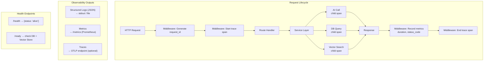
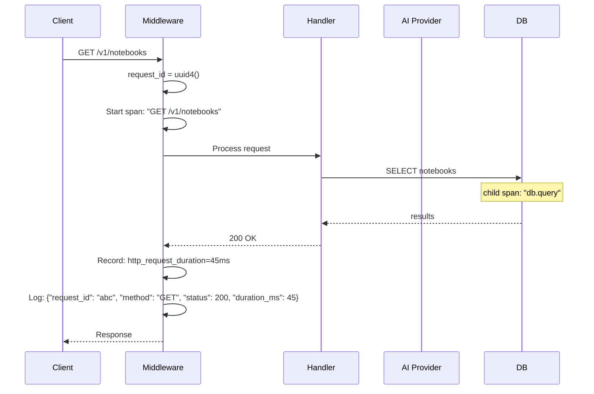

## Context

Crystalith 后端使用 cl-logs 包进行日志输出，但缺少结构化格式、性能指标和分布式追踪。生产环境排查问题依赖手动日志搜索，效率低下。

## Goals / Non-Goals

- Goals:
  - JSON 结构化日志，每个请求带有唯一 request_id
  - 关键指标的 Prometheus 格式导出
  - 可选的 OpenTelemetry 追踪（默认关闭）
  - 健康检查端点支持容器编排
- Non-Goals:
  - 不部署监控栈（Grafana/Prometheus 实例）
  - 不实现自定义告警规则
  - 不修改前端日志

## Decisions

- Decision: 使用 OpenTelemetry 作为追踪框架
- Alternatives considered:
  - Jaeger client → 社区已迁移至 OpenTelemetry
  - 自定义追踪 → 不标准，无法与生态集成

- Decision: Prometheus 格式导出指标
- Alternatives considered:
  - StatsD → 需要额外的收集器
  - 自定义 JSON 指标 → 不与 Grafana 等工具兼容

## Risks / Trade-offs

- OpenTelemetry 依赖较重 → 追踪功能默认关闭，仅在需要时启用
- 结构化日志体积增大 → 可配置日志级别控制输出量

## Architecture Flow

## Acceptance Criteria

- [ ] **AC-1**: 日志中间件在 `web/app.py` 的 FastAPI middleware 中注册
- [ ] **AC-2**: 日志格式兼容现有 `cl-logs`（`packages/cl-logs`）的 structlog 输出，JSON 模式下每行为有效 JSON
- [ ] **AC-3**: request_id 通过 `request.state.request_id` 传递，所有 `log.*()` 调用自动包含
- [ ] **AC-4**: `/health` 返回 `{"status": "alive"}`，响应时间 < 10ms
- [ ] **AC-5**: `/ready` 验证数据库连接（`AsyncDBManager`）和向量存储（`VectorStore`）可用性
- [ ] **AC-6**: `/metrics` 返回 Prometheus 文本格式，包含 `http_request_duration_seconds` histogram
- [ ] **AC-7**: `just test` 通过
- [ ] **AC-8**: 手动验证：请求一个 API 后，日志中出现 request_id、method、status、duration 字段

## Open Questions

- 是否需要前端性能指标（Core Web Vitals）？
