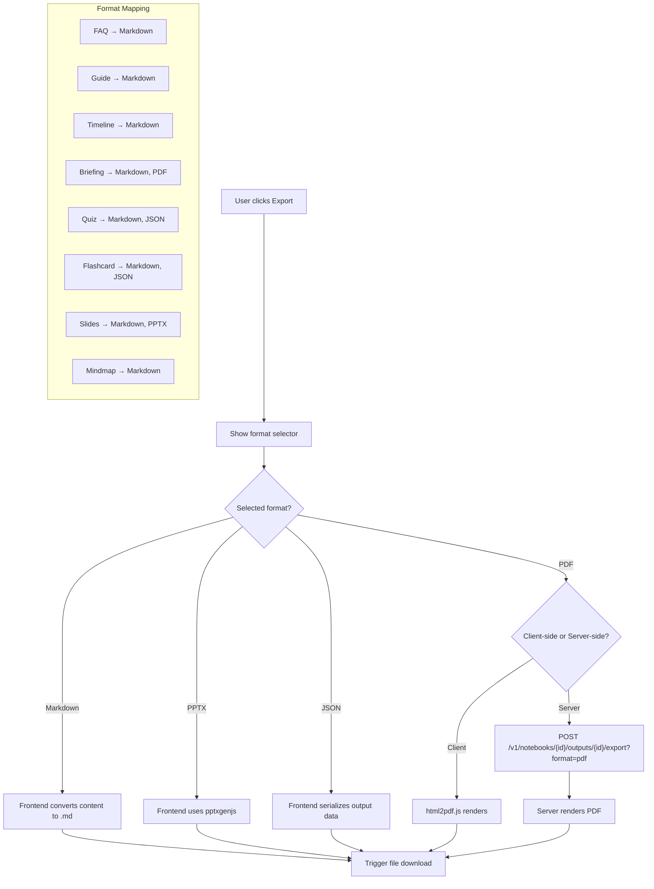

## 1. 导出基础设施
- [ ] 1.1 创建 useExport hook（统一导出逻辑、文件下载触发）
- [ ] 1.2 定义各输出类型支持的导出格式映射
- [ ] 1.3 实现 Markdown 格式的通用导出（前端直接转换）

## 2. Markdown 导出
- [ ] 2.1 FAQ 输出转 Markdown
- [ ] 2.2 Guide 输出转 Markdown
- [ ] 2.3 Timeline 输出转 Markdown
- [ ] 2.4 Briefing 输出转 Markdown
- [ ] 2.5 Quiz/Flashcard 输出转 Markdown
- [ ] 2.6 编写各格式转换的单元测试

## 3. 特殊格式导出
- [ ] 3.1 Slides 导出为 PPTX（前端使用 pptxgenjs 或后端渲染）
- [ ] 3.2 Quiz/Flashcard 导出为 JSON（Anki 兼容格式）
- [ ] 3.3 Briefing/Report 导出为 PDF（前端使用 html2pdf 或后端渲染）
- [ ] 3.4 编写特殊格式导出的测试

## 4. 导出 UI
- [ ] 4.1 OutputContent 组件添加统一的 "导出" 按钮
- [ ] 4.2 导出格式选择下拉菜单（根据输出类型显示可用格式）
- [ ] 4.3 导出进度提示（大文件/服务端渲染时）
- [ ] 4.4 编写导出 UI 交互测试

## 5. 验证
- [ ] 5.1 验证各输出类型的 Markdown 导出完整性和格式正确性
- [ ] 5.2 验证 Slides PPTX 导出可被 PowerPoint/LibreOffice 打开
- [ ] 5.3 验证 PDF 导出的排版和内容完整性

## Architecture Flow

## Acceptance Criteria

- [ ] **AC-1**: 导出按钮在 `features/workspace/domains/outputs/OutputContent.tsx` 或各 viewer 组件中
- [ ] **AC-2**: Markdown 转换逻辑纯前端，不依赖后端 API
- [ ] **AC-3**: 导出的 Markdown 文件包含完整内容，无截断
- [ ] **AC-4**: Slides PPTX 导出包含所有幻灯片页，每页标题和内容正确
- [ ] **AC-5**: `pnpm test` 通过，包含各导出格式的单元测试
- [ ] **AC-6**: 手动验证：导出 FAQ、Slides、Quiz 各一次，文件可正常打开和阅读
