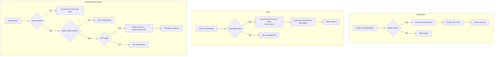
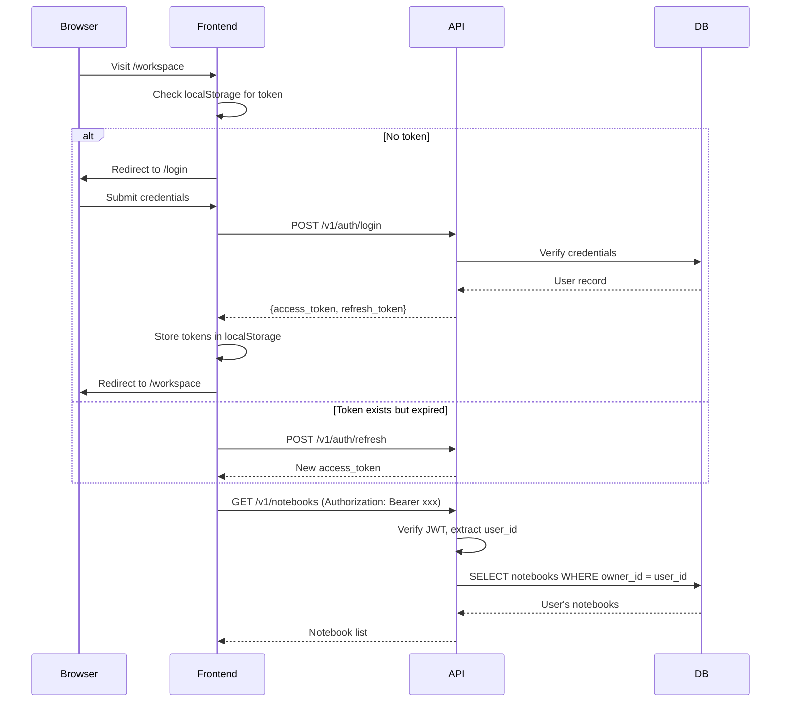
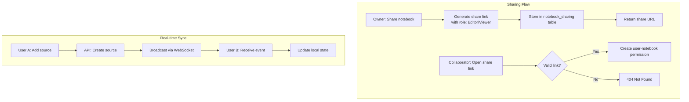

## Context

Crystalith 当前为单用户设计，无认证机制，也无共享/协作能力。团队使用场景需要：

- 身份与访问控制（谁能看/谁能写）
- notebook 共享与权限
- 实时协作（资源级事件同步，而非字符级协同编辑）

## Goals / Non-Goals

- Goals:
  - 支持邮箱+密码的用户注册和登录
  - 基于 JWT 的无状态会话管理
  - 数据按用户隔离
  - 可选匿名模式（单用户部署时可禁用认证）
  - 支持 notebook 共享（分享链接 + Owner/Editor/Viewer）
  - 实时同步关键事件（source/message/output/user presence）
- Non-Goals:
  - 不实现 OAuth / 第三方登录（可作为后续扩展）
  - 不实现组织/团队管理
  - 不实现字符级协同编辑（如 Google Docs）
  - 不实现复杂权限/审批流（仅 Owner/Editor/Viewer）
  - 不实现用户管理后台

## Decisions

- Decision: 使用 JWT（access token + refresh token）进行会话管理
- Alternatives considered:
  - Session cookie → 需要服务端存储，不适合无状态部署
  - API key → 简单但不适合 web 应用场景
  - OAuth2 Password Flow → 过于复杂

- Decision: 密码使用 bcrypt 哈希存储
- Alternatives considered:
  - argon2 → 更安全但依赖 C 扩展
  - scrypt → 内置但 bcrypt 社区支持更好

## Risks / Trade-offs

- JWT token 泄露风险 → access token 短有效期（15min）+ refresh token
- 迁移已有数据 → 匿名模式数据归属默认用户，后续可手动关联
- WebSocket 连接数在高并发时的资源消耗 → 通过连接池与心跳管理缓解
- 并发写入冲突 → 资源级别使用乐观锁/最后写入胜出策略（不做字符级合并）

## Migration Plan

1. 添加 user 表和认证 API（不影响现有端点）
2. 添加认证中间件（默认启用匿名模式）
3. 前端添加登录流程
4. 切换配置启用认证
5. 添加 WebSocket 基础设施（可独立测试）
6. 实现共享与权限（后端 → 前端）
7. 增量落地实时同步事件类型

## Architecture Flow

## Acceptance Criteria

- [ ] **AC-1**: user 表在 `shared/db/models/` 下定义，notebook 表新增 owner_id 外键
- [ ] **AC-2**: 认证 API 在 `features/auth/` 下新建 feature slice
- [ ] **AC-3**: JWT 中间件作为 FastAPI middleware 或 Depends，在 `shared/auth/` 下定义
- [ ] **AC-4**: `config/app.schema.gen.json` 更新包含 `auth` 配置段
- [ ] **AC-5**: 前端 `api/setup.ts` 的 client interceptor 自动附加 Authorization header
- [ ] **AC-6**: 匿名模式（`auth.enabled=false`）下所有现有功能不受影响
- [ ] **AC-7**: `just test` 和 `pnpm test` 通过
- [ ] **AC-8**: WebSocket 端点在 `web/app.py` 或 `features/` 下注册
- [ ] **AC-9**: notebook_sharing 表在 `shared/db/models/` 下定义
- [ ] **AC-10**: 权限检查中间件与现有 Depends 模式一致（Owner/Editor/Viewer）
- [ ] **AC-11**: Viewer 角色在 UI 中为只读态（写操作禁用）
- [ ] **AC-12**: 手动验证：两个浏览器 tab 打开同一 notebook，一方添加 source 后另一方 < 2s 内看到更新

## Open Questions

- 是否需要邮箱验证（注册后发送验证邮件）？
- 密码强度策略？
- 是否需要协作历史/操作日志？
- 免费用户的协作人数限制？
