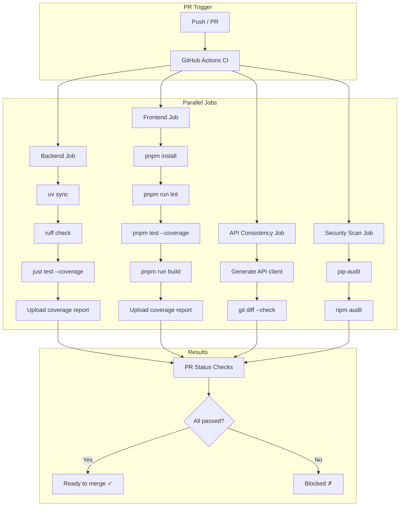

## 1. 基础 CI 流水线
- [ ] 1.1 创建 PR 触发的 CI workflow（push + pull_request）
- [ ] 1.2 后端 job：安装依赖 → 类型检查 → 运行测试 → 覆盖率报告
- [ ] 1.3 前端 job：安装依赖 → 类型检查 → 运行测试 → 构建检查
- [ ] 1.4 API 一致性 job：验证生成的 API client 是否最新
- [ ] 1.5 验证 CI workflow 在 PR 上正确触发

## 2. 代码质量检查
- [ ] 2.1 后端添加 ruff 代码检查
- [ ] 2.2 前端添加 ESLint 检查
- [ ] 2.3 测试覆盖率报告（后端 pytest-cov，前端 vitest coverage）
- [ ] 2.4 PR 评论中自动显示覆盖率变化

## 3. 安全扫描
- [ ] 3.1 Python 依赖漏洞扫描（safety 或 pip-audit）
- [ ] 3.2 Node.js 依赖漏洞扫描（npm audit）
- [ ] 3.3 每周定时扫描 + PR 触发扫描

## 4. 自动化发布
- [ ] 4.1 基于 tag 的后端发布 workflow
- [ ] 4.2 基于 tag 的前端构建和部署 workflow
- [ ] 4.3 自动生成 changelog（基于 commit message）

## 5. 验证
- [ ] 5.1 创建测试 PR 验证 CI 流水线完整运行
- [ ] 5.2 验证测试失败时 PR check 标记为红色
- [ ] 5.3 验证安全扫描能检测到已知漏洞

## Architecture Flow

## Acceptance Criteria

- [ ] **AC-1**: CI workflow 定义在 `.github/workflows/ci.yml`，与现有 `check-python-sdk.yml` 和 `release-python-sdk.yml` 不冲突
- [ ] **AC-2**: 后端 job 使用 `uv` 安装依赖（与项目现有的 `uv sync` 一致）
- [ ] **AC-3**: 前端 job 使用 `pnpm`（与项目现有配置一致）
- [ ] **AC-4**: API 一致性 job 运行 `pnpm run api:generate` 后检查是否有 diff
- [ ] **AC-5**: 安全扫描结果以 PR 评论形式展示
- [ ] **AC-6**: 手动验证：创建一个故意失败测试的 PR，CI 标记为 failed
